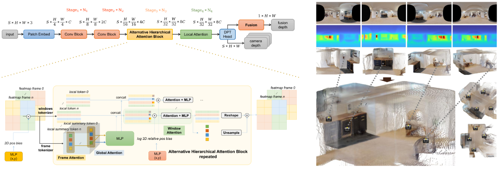

# FastViDAR: Real-Time Omnidirectional Depth Estimation via Alternative Hierarchical Attention

<p align="center">
  <b><a href="https://3F7DFC.github.io/FastVidar/">Project Page</a></b> ·
  <a href="#-news">News</a> ·
  <a href="#-quick-start">Quick Start</a> ·
  <a href="#-models--checkpoints">Models</a> ·
  <a href="#-citation">Citation</a>
</p>

<p align="center">
  
</p>


## 🔎 TL;DR
FastViDAR takes four fisheye camera inputs and produces a full 360° depth map alongside per-camera depth, fused ERP depth, and confidence maps — in real time. We propose Alternative Hierarchical Attention (AHA), which alternates window-level local self-attention with per-frame and global self-attention over compact summary tokens, enabling strong cross-view reasoning at low overhead. We further fuse multi-view depths on a shared equirectangular (ERP) grid for seamless omnidirectional depth. FastViDAR reaches competitive accuracy with up to 20 FPS on NVIDIA Orin NX (TensorRT FP16) and 3.3× speedup over VGGT at 640×320 with 4 views.


## ✨ Highlights
- ⚡️ Alternative Hierarchical Attention (AHA): alternating local window attention with frame/global attention over summary tokens; ~16× theoretical reduction vs full attention at typical settings.
- 🌍 ERP-centric pipeline: fisheye views are unified on an equirectangular grid, removing lens-specific intrinsics from learning.
- 🔁 ERP fusion: distance-aware splatting and masked averaging on ERP yield consistent, seamless 360° depth.
- 🛠 Flexible camera rigs: supports arbitrary numbers of cameras and ultra-wide FOV (>180°).
- 🚀 Real-time and deployable: up to 20 FPS on NVIDIA Orin NX (embedded, TensorRT FP16) and high throughput on desktop GPUs.


## 🗞 News
- Codebase, configs, and pretrained checkpoints will be released progressively. Watch the repo to get updates.
- Demo video and arXiv preprint are coming soon.


## 🔗 Links
- Project Page: https://3F7DFC.github.io/FastVidar/
- Paper (ICRA): to appear (arXiv TBA)
- Demo Video: TBA


## 🧭 Table of Contents
- [TL;DR](#-tldr)
- [Highlights](#-highlights)
- [News](#-news)
- [Links](#-links)
- [Installation](#-installation)
- [Datasets](#-datasets)
- [Models & Checkpoints](#-models--checkpoints)
- [Quick Start](#-quick-start)
- [Training](#-training)
- [Evaluation](#-evaluation)
- [Inference Demo](#-inference-demo)
- [Benchmarks](#-benchmarks)
- [Visualization](#-visualization)
- [Citation](#-citation)
- [License](#-license)
- [Acknowledgements](#-acknowledgements)
- [Contact](#-contact)


## 🔧 Installation (TBD)
We recommend Python ≥ 3.10 and PyTorch ≥ 2.7.0. Adjust CUDA wheels to your environment.

```bash
git clone https://github.com/3F7DFC/FastVidar.git
cd FastVidar

# Optional: create a virtual environment
python3 -m venv .venv && source .venv/bin/activate

# Install dependencies (replace with the official requirements when released)
pip install -U pip
pip install -r requirements.txt  # if provided

# Minimal example (adjust CUDA index URL to your setup)
pip install torch torchvision torchaudio --index-url https://download.pytorch.org/whl/cu121
pip install numpy opencv-python matplotlib einops tqdm pyyaml
```


## 📦 Datasets (TBD)
We provide ERP-aware training and evaluation on HM3D and Stanford 2D-3D-S, plus custom data. Organize your data as follows:

```
datasets/
  <dataset_name>/
    images/            # input images (ERP/fisheye/surround-view)
    depths/            # ground-truth depth, if available
    splits/            # train/val/test split files (optional)
```

For custom datasets, configure paths and camera models (e.g., ERP projection, fisheye intrinsics) in `configs/<your_dataset>.yaml`.

Dataset notes (from the paper):
- HM3D (train/ablate): rendered 4-camera rigs with randomized relative poses and FOV in [160°, 360°]; 800 train / 200 test scenes.
- 2D-3D-S (zero-shot): a fixed 4-fisheye ring (FOV 220°) with 90° separation; evaluated without fine-tuning.


## 🧠 Models & Checkpoints (TBD)
Pretrained weights will be released here. Place them under:

```
checkpoints/
  fastvidar_<variant>.pth
```


## 🚀 Quick Start (TBD)

```bash
# Single-GPU training example
python tools/train.py \
  --config configs/fastvidar_base.yaml \
  --data-root datasets/<dataset_name> \
  --work-dir work_dirs/fastvidar_base

# Evaluation
python tools/eval.py \
  --config configs/fastvidar_base.yaml \
  --data-root datasets/<dataset_name> \
  --checkpoint checkpoints/fastvidar_base.pth

# Inference demo
python tools/demo.py \
  --input assets/example.jpg \
  --checkpoint checkpoints/fastvidar_base.pth \
  --output outputs/example_depth.png
```


## 🏋️ Training (TBD)
Multi-GPU (distributed) training example; adjust to your cluster setup:

```bash
torchrun --nproc_per_node=8 tools/train.py \
  --config configs/fastvidar_base.yaml \
  --data-root datasets/<dataset_name> \
  --work-dir work_dirs/fastvidar_base_dist
```

Key configuration knobs (typical in `configs/*.yaml`):
- Model variant, AHA block counts, window size (e.g., 7×7), and summary tokens.
- Input resolution and ERP specifics; number of cameras/views S (e.g., S=4).
- Loss: masked ERP-area weighted depth loss with multi-scale gradient term.
- Optimizer/schedule: AdamW + OneCycleLR (example); AMP/mixed precision.


## 📏 Evaluation (TBD)
Supports common depth metrics on ERP: AbsRel, RMSE, Log10, and δ<1.25. Example:

```bash
python tools/eval.py \
  --config configs/fastvidar_base.yaml \
  --data-root datasets/<dataset_name> \
  --checkpoint checkpoints/fastvidar_base.pth
```

By default, results are saved under `work_dirs/<exp>/eval/`.


## 🎬 Inference Demo (TBD)
Single image or video stream inference:

```bash
python tools/demo.py \
  --input assets/example.jpg \
  --checkpoint checkpoints/fastvidar_base.pth \
  --output outputs/example_depth.png
```

For video/webcam streams, see script flags in `tools/demo.py` (e.g., `--video`, `--webcam`, `--fps`).


## 📊 Benchmarks (TBD)
Zero-shot comparison on 2D-3D-S (selected metrics):

| Method        | AbsRel ↓ | RMSE ↓ | Log10 ↓ | δ<1.25 ↑ | Time (ms) |
|---------------|----------|--------|---------|----------|-----------|
| VGGT          | 0.557    | 1.934  | 0.396   | 0.043    | 120       |
| OmniStereo    | 0.619    | 1.450  | 0.154   | 0.554    | 66        |
| LightStereo-M | 0.125    | 0.667  | 0.050   | 0.851    | 33        |
| FastViDAR     | 0.119    | 0.433  | 0.046   | 0.929    | 36        |

Notes:
- FastViDAR uses 4 ERP views (FOV 220° each). LightStereo uses ERP splitting to stereo; VGGT uses 8 pinhole projections (100° FOV) and is projected back to ERP for evaluation.
- On Orin NX with TensorRT FP16, FastViDAR reaches up to 20 FPS.

Assets placeholders:

```
assets/figures/
  qualitative_samples.png
  speed_accuracy_tradeoff.png
```


## 🖼 Visualization (TBD)
- Qualitative comparisons across ERP/fisheye/surround-view.
- Error maps and fused point clouds on ERP.
- Latency and throughput analyses across hardware.

We will provide ready-to-use notebooks and scripts under `tools/`.


## 📚 Citation (TBD)
If you find FastViDAR useful, please cite:

```bibtex
@inproceedings{fastvidar_icra2026,
  title     = {FastViDAR: Real-Time Omnidirectional Depth Estimation via Alternative Hierarchical Attention},
  author    = {Author, A. and Author, B. and Author, C.},
  booktitle = {IEEE International Conference on Robotics and Automation (ICRA)},
  year      = {2026},
  note      = {Project page: https://3F7DFC.github.io/FastVidar/}
}
```


## 📄 License (TBD)
This repository will be released under the MIT License (subject to change until `LICENSE` is added). Please check the repository for updates.


## 🙏 Acknowledgements (TBD)
We thank the authors and maintainers of related open-source projects and datasets. Our implementation is inspired by community best practices; we will add detailed references upon release.


## ✉️ Contact (TBD)
For questions, suggestions, or collaborations, please open an issue or contact the authors (emails TBA).

 
